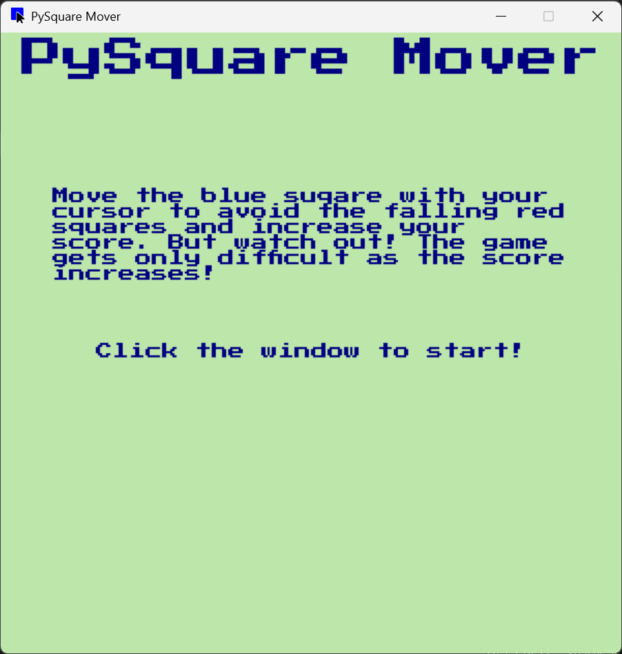
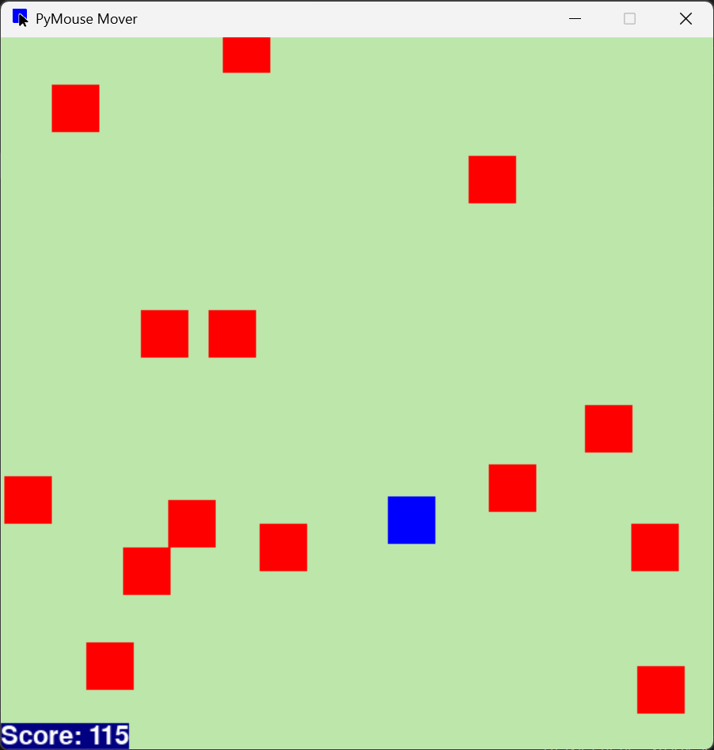
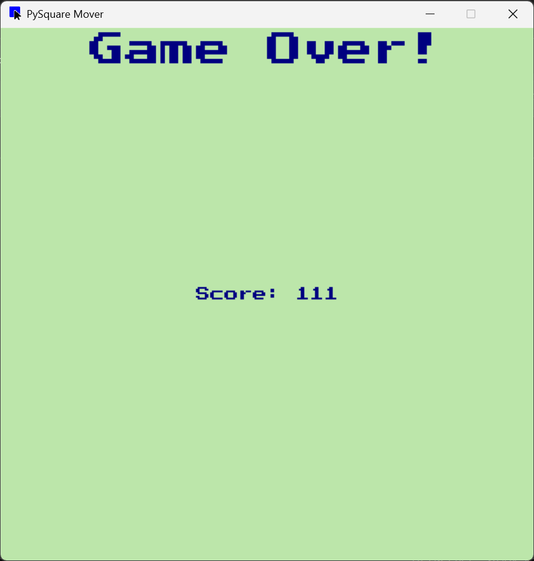

# PySquare Mover
PySquare Mover is a game solely by me, Chisom A., where you move a blue square with your mouse and must avoid the red squares falling. As the game continues, avoiding the falling squares becomes harder. This game can be useful as it tests the player's reflexes and coordination, and sees how long they can go in a single game session.

## Installation Instructions
Before running the game, you must have Python3 and Pygame installed ([Instructions for Installing Pygame](https://www.pygame.org/wiki/GettingStarted)).
To run the game, download all the files, except the `_media` folder, and run `main.py`. This provides the best experience, as running `main.py` without the other files causes the game to run without its icon and replaces the font with a basic one.

## Screenshots
<figure>
    
</figure>

<figure>
    
</figure>

<figure>
    
</figure>

## Demonstration
<figure>
    <a href="_media/demo.mp4">
    
</figure>

## Tech Stack
*	Python – the programming language used to code the game
*	Pygame – the Python library used to render all the GUI components and handle the collision
*	Random, Schedule – the Python libraries used to randomize the enemy square’s position and run some functions at a certain rate, respectively
* Photopea – the graphic editing tool used to create the game’s icon

## Development History
This game was created for the IGNITON - Fall 2025 Challenge at the Community of Driven Engineers (CODE) Club @ Prince George’s Community College. The game's idea was formed in October 2025, with development of the game starting early November 2025.
Before the development of this game, I wasn’t very familiar with the Python programming language and the Pygame library, so I had to read resources to guide me. To learn more about the Python programming language, I read the Python 3 cheatsheet from [Codecademy.com](https://www.codecademy.com/learn/learn-python-3/modules/learn-python3-hello-world/cheatsheet). For the Pygame library, I read guides from [GeeksforGeeks](https://www.geeksforgeeks.org/python/pygame-tutorial) on setting up the Pygame library and utilizing its functions for gameplay purposes. These functions include setting up the text and squares on-screen and locating the mouse position. I also read it to learn the [schedule library for Python](https://www.geeksforgeeks.org/python/python-schedule-library). I also read documentation from [Pygame](https://www.pygame.org/docs/ref/rect.html) to detect collision between the blue square and the red squares.
Overall, this project took me a few weeks to complete. I am very proud of pushing myself from someone who wasn’t well versed in Python and unfamiliar with the Pygame library, to making a game using them. I also enjoyed working on some of the minor details, including coming up with the game’s name and its icon.
